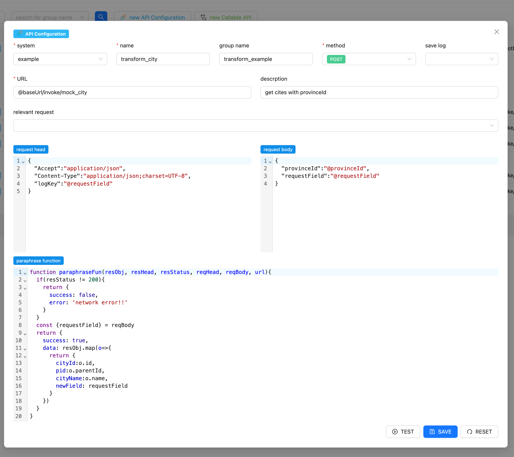
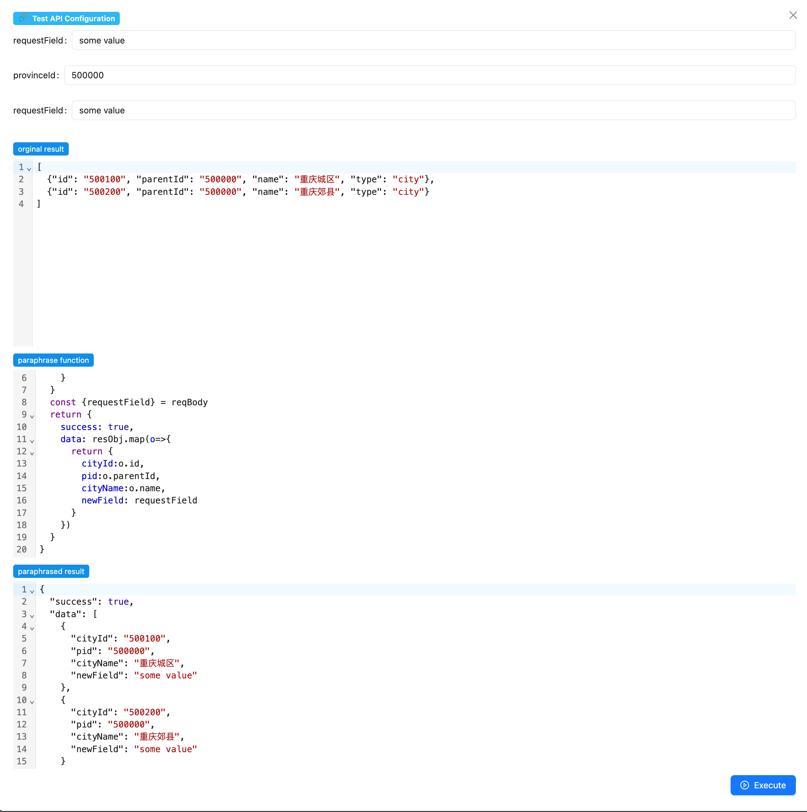
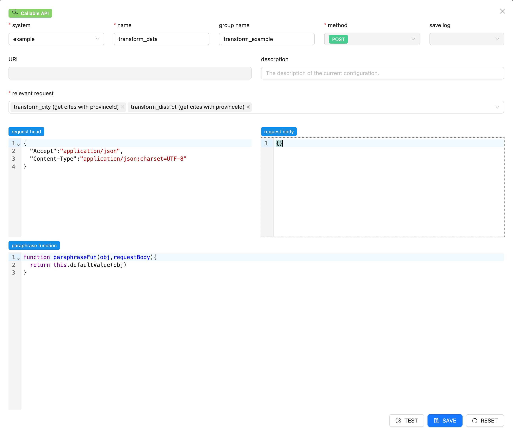
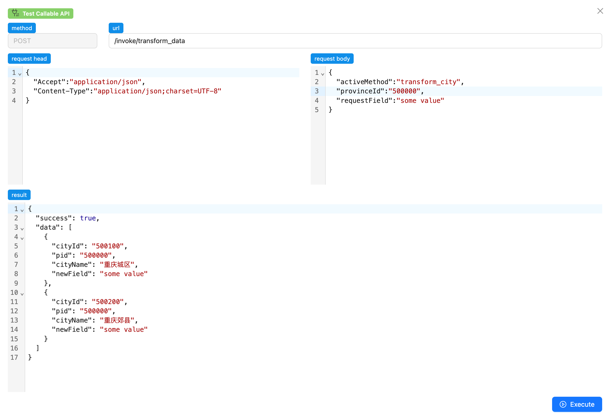
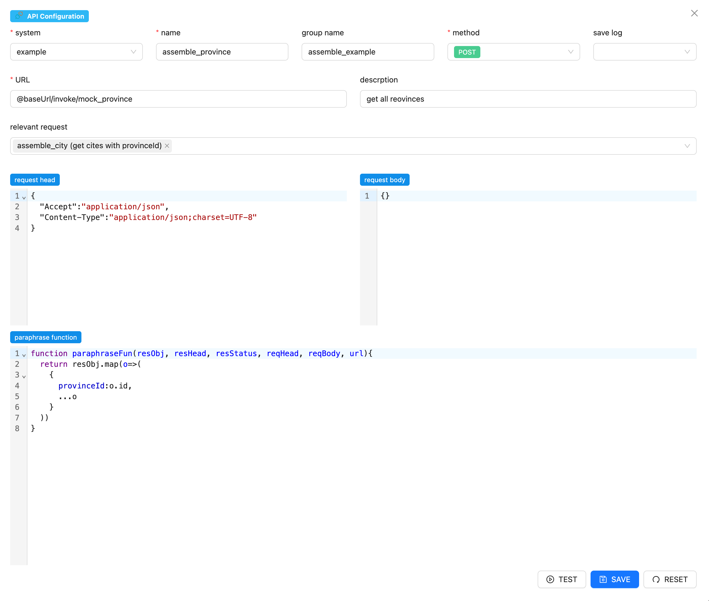

# 本项目用于配置并转发第三方接口

在调用其他系统的接口时，通常需要将返回的数据按照自己的需求进行转化，比如数据的格式或某个字段的名称，本项目的主要作用就是提供一个使用配置的方式执行 js 代码的运行环境，让使用者可以自行编写 js代码来执行上面的数据转化的需求，并且将配置好的内容发布成一个新的接口，这样在调用不同第三方的接口时，可以将它们转化成统一的数据格式和统一的字段命名，以方便具体的业务逻辑代码调用。

# useage

代码运行需要node,MySQL,Redis环境,只适用于JSON格式的接口  
首先在`/svc/config/config.default.js`中配置mysql和redis的链接信息,
并且执行`/svc/initial.sql`中的建表语句  
在 /svc 目录下,执行`npm i`安装所需依赖，相同目录下执行 `npm start`启动程序  
通过 http://127.0.0.1:7001/index.html 访问程序配置页面

/ui 文件下是前端页面的代码，将`/ui/build/`的文件复制到`/svc/app/public/`下，即可通过`http://127.0.0.1:7001/index.html`访问

# example

下面通过三个比较典型的场景来介绍具体的使用方式，请先将 /svc/example.sql 中的示例配置导入数据库

## 场景1 配置并转发第三方接口

系统有两种不同概念的配置 `API Configuration`和`Callable API`
| | |  
| --- | --- |
| `API Configuration` | 配置第三方接口的调用信息，本身不会做为新的接口发布 |
| `Callable API` | 发布一个新的可被外界调用的接口，需要关联`API Configuration`使用 | 
|  |  |

现有两个第三方接口 (正常情况下接口应来自其他系统，这里为了举列，只能调用自身配置的接口) 
```
http://127.0.0.1:7001/invoke/mock_city
 {
    "provinceId":"xxxx"
 }
```

```
http://127.0.0.1:7001/invoke/mock_district
 {
    "cityId":"xxxx"
 }
```
者两个接口分别通过`provinceId`查询城市的列表，通过`cityId`查询地区的列表  

如需要创建一个新的配置，点击页面 `new API Configuration`,打开一个接口配置页面，这里直接点击 `transform_city` 这条记录的编辑图标按钮即可
下面以mock_city接口 为列说明具体的配置   


### system
和`svc/config/config.default.js` 文件中的`config.systemInfo`配置关联，使用者需要根据自己的实际需求修改这个配置

### name
调用的名称，要求全局唯一

### group name
用来查询使用，通常把几个业务逻辑相关的接口放在一组

### save log
配置为YES的话如果调用该接口，会将调用的信息记录到`invoke_log`表中，在页面上LOG的Tab中可以查看记录，同时在请求头中有一个`"logKey":"@requestField"`的配置，这个配置不是必须的，配置以后日志会以 @requestField 的值为关键字记录，方便查询。

### URL
第三方接口的地址。@baseUrl 是程序保留的关键字，在调用时会被替换成`config.systemInfo`中对应 url的内容，也可以不使用 @baseUrl,直接使用接口原本的地址

### relevant request
在下一个使用场景中介绍

### request body
请求的参数，使用 @xxx 作为参数的占位符，在具体调用接口时，具体传入的值会将URL，head，body中的 @xxx 的值替换，具体调用的方式会在随后介绍

### paraphrase function
一段合法的js 代码，用来将接口返回的接口解析为使用者想要的格式，方法的回调参数  
`resObj, resHead, resStatus, reqHead, reqBody, url` 
分别对应
responseBody,responseHead,httpCode,requestHead,requestBody,url
在图中的列子中，改变了数据的结构和字段名称，并将 requestBody 中的字段 requestField 方到返回结果中

配置完成后可以点击 TEST 按钮打开测试页面来确认配置是否正确   
在前面的页面中使用 @xxx 标记的字段会作为参数要求调用者赋值，在解析函数上下的两个窗口中的内容分别对应了接口原生返回的数据和通过解析函数处理过的数据，如果解析函数本身有错误，下面的窗口可能不会正常显示。可以在这个窗口中修改和调试解析函数。（<span style="color: red;">调试完成后，请将解析函数的内容复制到前一个窗口进行保存，当前窗口不会保存修改的内容</span>）

### 将上面的配置发布成一个新的接口

如需要创建一个新的接口，点击页面 `new Callable API`,打开一个接口配置页面，这里直接点击 `transform_data` 这条记录的编辑图标按钮即可。

这里的 name 会做为新接口名称，程序将会发布一个URL为
`http://127.0.0.1:7001/invoke/transform_data` 的post接口  
relevant request 的配置表示可以通过该接口调用 `transform_city` `transform_district`这两个配置好的第三方接口

在解析函数中使用一个内置函数 `this.defaultValue(obj)` 获取到第三方接口返回的值，这里的obj 中的内容在外面多套了一层，类似这样:
```
{
    transform_city:{
        ....
    }
}
``` 
采用这样的形式是因为在其他使用场景时，obj对象会很复杂，单在这里只需要使用`this.defaultValue(obj)` 即可获取想要的结果

点击TEST 按钮可以打开调用接口的测试页面 
由于 `http://127.0.0.1:7001/invoke/transform_data` 已经是一个可以对外调用的接口，所以这里也可以使用其他接口工具如 curl或postman来调用。

这里先补充一下 @xxx 占位符的使用，入参
```
{
  "activeMethod":"transform_city",
  "provinceId":"500000",
  "requestField":"some value"
}
```
是根据 `transform_city` 中的配置
```
{
  "provinceId":"@provinceId",
  "requestField":"@requestField"
}
```
决定的 @xxx 后面的 xxx 才是调用是入参的字段，比如现在将`transform_city`的配置修改为
```
{
  "provinceId":"@id",
  "requestField":"@field"
}
```
那么调用的入参也要对应修改为
```
{
  "activeMethod":"transform_city",
  "id":"500000",
  "field":"some value"
}
```

由于`transform_data` 关联了两个配置`transform_city` `transform_district`，所以需要使用参数 `"activeMethod":"transform_city"` 来指定需要调用那个配置，  
也可以使用`"activeMethod":["transform_city","transform_district"]` 来同时调用者两个配置，这种情况需要入参中加入`transform_district`所需要的参数，同时外层的解析函数也需要对应修改，类似这样
```
{
  activeMethod":["transform_city","transform_district"],
  "provinceId":"500000",
  "requestField":"some value",
  "cityId":"xxxx" //parameter for transform_district
}
``` 
如不传递 activeMethod这个参数，会同时调用所有关联的个配置，如果某个配置的参数没有被正确传递，则会导致返回结果异常。  
让一个`Callable API` 关联多个 `API Configuration`，并在调用时使用`"activeMethod":"xxx"`来指定需要调用那个配置是比较常见的使用方式。


## 场景2 组合多个接口

假设现在有3个第三方接口
```
http://127.0.0.1:7001/invoke/mock_province
 {}
```

```
http://127.0.0.1:7001/invoke/mock_city
 {
    "provinceId":"xxxx"
 }
```

```
http://127.0.0.1:7001/invoke/mock_district
 {
    "cityId":"xxxx"
 }
```
接口`mock_district`的参数需要通过接口`mock_city`查询，接口`mock_city` 的参数又要需要通过接口`mock_province` 查询,在这种情况下，就可以通过先调用`mock_province`，然后在关联调用`mock_city`，再关联调用`mock_district`，将3个接口组合起来，再使用一个可调用的接口配置去关联`mock_province`，封装成一个接口，就可以一次获取3个接口下的所有信息。
这种组合最常见的业务场景是假设有第一个第三方业务系统提供了两个接口，一个获取资源的列表，根据列表中的参数又何以去获取资源的详情，那么把两个接口组合起来就可以一次获取列表和详情

打开`assemble_province`的配置页面
可以这里关联了`assemble_city`,由于`assemble_city`的入参是
```
{
  "provinceId":"@provinceId"
}
```
所以在这里的解析函数中加入了一个新的字段
```
{
    provinceId:o.id,
    ...o
}
```
这样`assemble_province`的结果就可以作为`assemble_city`的入参，程序会在前面的接口返回后去调用下级的关联的接口。(这里调用下级关联接口还有一个条件，就当前接口的返回值必须是一个数组，按照数组的每一项去并发调用下级接口) 
这个过程是并发进行的，得益于node的并发机制，我个人在生存环境中使用这样的调用没有遇到性能问题。

`assemble_city` 的配置和`assemble_province`类似。

现在回到可调用接口`assemble_all`的配置，它关联了`assemble_province`，层层关联后就可以取到所有的数据，取到的数据大概是这样的
```
{
  "assemble_province-1": [
    {"provinceId": "110000", "id": "110000", "parentId": "0", "name": "北京市", "type": "province"},
    {"provinceId": "120000", "id": "120000", "parentId": "0", "name": "天津市", "type": "province"},
    {"provinceId": "500000", "id": "500000", "parentId": "0", "name": "重庆市", "type": "province"}
  ],
  "assemble_city-1-2": [
    {"cityId": "110100", "id": "110100", "parentId": "110000", "name": "北京城区", "type": "city"}
  ],
  "assemble_city-1-3": [
    {"cityId": "120100", "id": "120100", "parentId": "120000", "name": "天津城区", "type": "city"}
  ],
  "assemble_city-1-4": [
    {"cityId": "500100", "id": "500100", "parentId": "500000", "name": "重庆城区", "type": "city"},
    {"cityId": "500200", "id": "500200", "parentId": "500000", "name": "重庆郊县", "type": "city"}
  ],
  "assemble_district-1-2-3": [
    {"id": "110101", "parentId": "110100", "name": "东城区", "type": "district"},
    {"id": "110102", "parentId": "110100", "name": "西城区", "type": "district"}
  ],
  "assemble_district-1-3-4": [
    {"id": "120101", "parentId": "120100", "name": "和平区", "type": "district"},
    {"id": "120102", "parentId": "120100", "name": "河东区", "type": "district"}
    {"id": "120119", "parentId": "120100", "name": "蓟州区", "type": "district"}
  ],
  "assemble_district-1-4-5": [
    {"id": "500101", "parentId": "500100", "name": "万州区", "type": "district"},
    {"id": "500156", "parentId": "500100", "name": "武隆区", "type": "district"}
  ],
  "assemble_district-1-4-6": [
    {"id": "500229", "parentId": "500200", "name": "城口县", "type": "district"},
    {"id": "500230", "parentId": "500200", "name": "丰都县", "type": "district"}
  ]
}
```
所有的数据通过 `name-序号` 的形式平铺在一个对象中，这里的序号是为了保证所有的key 不重复，序号本身没有业务逻辑上的意义，使用者需要按照自身的需要将数据拼接起来，在解析函数中，`const districtList = this.keyList(obj,'assemble_district')` `this.keyLists`是一个内置函数，它将所有以相同name 开头的数据拼接成一个数组， 可调用接口的解析函数中一共有两个内置函数。另一个是前面提到的`this.defauleValue`。

通过示列中的解析函数，上面的解析成了最后的形式。读者可以自行调用接口查看最终的结果


## 场景3 生存模拟数据

上面介绍内容是基于自身配置模拟数据接口实现的，可以查询对应 mock 的配置查看具体的细节，程序本身有一个 http://127.0.0.1:7001/doNothing 的接口，这个接口返回一个空对象，可以使用这个接口的解析函数返回 mock 数据，也可以在这里保存一些其他程序需要的json格式的配置数据，这样其他程序可以调用接口来获取这些配置，这样其他程序就不用专门建表来处理某些配置信息，并且修改也十分方便。


